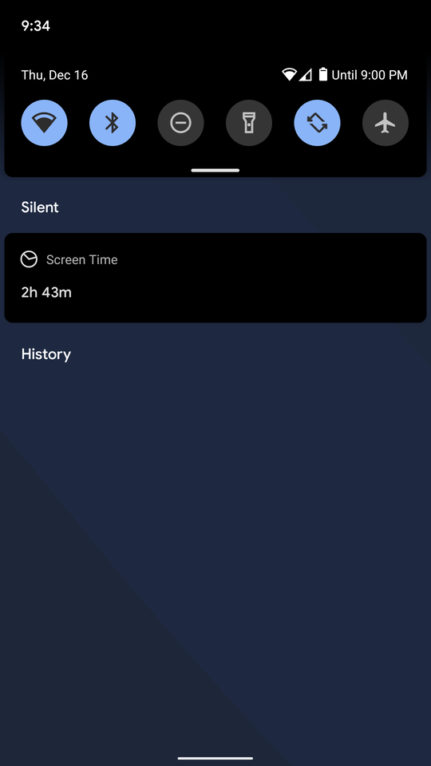
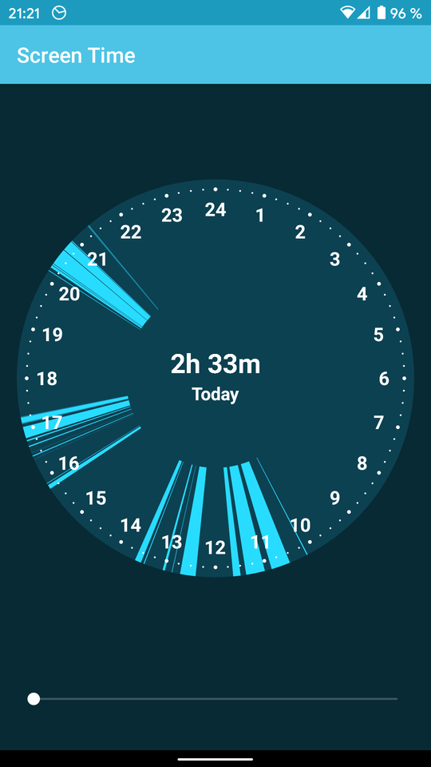
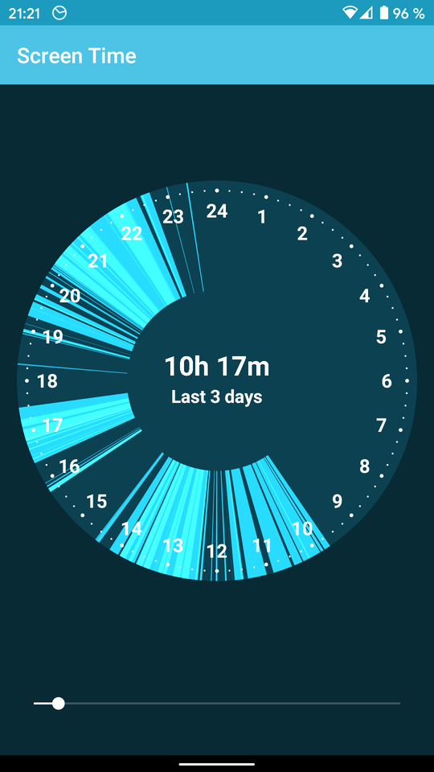

# Screen Time

Displays your screen time in a permanent notification.

By making screen time more prominent, you can get a better sense of how much
of the day you spend on your phone. Without judgement. Just so you know.

Sure, there's Google's Digital Wellbeing app and a lot of other apps that
track app usage. But I just like to see my screen time at a glance without
having to open an app. And I'm not really interested in seeing what apps
I've used. Rather, I want to see _when_ I use my phone.

So, primarily this is a "scratch your own itch" app.

## Screenshots

## Download

